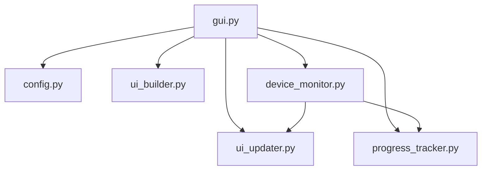

# GUI Application Architecture

The `app/` package provides a graphical user interface for Samsung firmware downloads with automatic device detection and firmware management.

## Overview

The GUI application is built with [customtkinter](https://github.com/TomSchimansky/CustomTkinter) and follows a modular architecture pattern, separating concerns into six focused modules:

- **gui.py** (280 lines) - Main application window and lifecycle
- **device_monitor.py** (363 lines) - Device detection and firmware orchestration
- **ui_builder.py** (352 lines) - UI widget creation and layout
- **ui_updater.py** (230 lines) - Thread-safe UI updates
- **progress_tracker.py** (154 lines) - Progress calculations and tracking
- **config.py** (84 lines) - Configuration management

## Module Dependencies



### Dependency Flow

```
gui.py (main orchestrator)
  ├─> config.py (settings via AppConfig dataclass)
  ├─> ui_builder.py (creates CTk widgets, returns dict)
  ├─> ui_updater.py (thread-safe updates via after())
  ├─> progress_tracker.py (calculations, callbacks)
  └─> device_monitor.py (AT detection, firmware ops)
        ├─> ui_updater (status/field updates)
        └─> progress_tracker (via callback)
```

## Module Responsibilities

### gui.py - Main Application

**Purpose**: Application window orchestration and lifecycle management

**Key Features**:
- Window setup (geometry, icon, appearance)
- Startup cleanup coordination
- Monitoring thread management
- Stop functionality coordination

**Main Class**: `FirmwareDownloaderApp(ctk.CTk)`

### config.py - Configuration

**Purpose**: Load and manage application settings from TOML

**Key Features**:
- Parse `app/config.toml` file
- Provide `AppConfig` dataclass
- Handle missing config gracefully with defaults

**Configuration Sections**:
- `[gui]` - UI element toggles (btn_dryrun, btn_autofus)
- `[devices]` - Device behavior (auto_fusmode, csc_filter)

### ui_builder.py - Widget Creation

**Purpose**: Create and layout all customtkinter widgets

**Key Features**:
- Create status frame
- Create device information frame (model, firmware, region, etc.)
- Create progress frame (bar, label, stop button)
- Create firmware components frame
- Create settings frame (checkboxes, labels)
- Create splash screen for startup

**Main Class**: `UIBuilder`

**Returns**: Dictionary of widget references for other modules to use

### ui_updater.py - Thread-Safe Updates

**Purpose**: Update UI widgets from background threads safely

**Key Features**:
- Thread-safe updates via `root.after(0, callback)`
- Update status messages
- Update device information fields
- Update progress messages with color coding
- Update firmware component paths
- Manage stop button state

**Main Class**: `UIUpdater`

**Thread Safety**: All updates scheduled on main thread using Tkinter's `after()` mechanism

### progress_tracker.py - Progress Tracking

**Purpose**: Calculate progress, ETA, and throughput

**Key Features**:
- Throttle progress updates (avoid UI slowdown)
- Calculate elapsed time and ETA
- Track throughput (MB/s)
- Format time durations
- Handle multiple stages (download, decrypt, extract)

**Main Class**: `ProgressTracker`

**Update Conditions**:
- Task completion
- Progress change >= 1%
- At least 100ms elapsed since last update

### device_monitor.py - Device Detection

**Purpose**: Monitor for Samsung devices and orchestrate firmware operations

**Key Features**:
- Background monitoring loop
- AT command device detection
- Firmware version checking via FOTA
- Download/decrypt/extract orchestration
- Error handling for various failure modes
- Stop check integration

**Main Class**: `DeviceMonitor`

**Detection Method**: Uses `device.read_device_info_at()` for AT protocol communication

## Communication Patterns

### Thread Safety

All UI updates from background threads use Tkinter's `after()` mechanism:

```python
self.root.after(0, lambda: widget.configure(text="New value"))
```

### Callback Pattern

The progress tracker uses a callback pattern to decouple progress calculations from UI updates:

```python
# Progress tracker callback signature
callback(stage: str, done: int, total: int, label: str)

# Device monitor progress callback
progress_callback(stage: str, done: int, total: int)
```

### Stop Mechanism

The stop functionality uses a shared flag checked by download/decrypt operations:

```python
def stop_check() -> bool:
    return self.stop_task

# Passed to download service
download_and_decrypt(..., stop_check=stop_check)
```

## Application Flow

### 1. Initialization

```
FirmwareDownloaderApp.__init__()
  ├─> init_db()
  ├─> load_config()
  ├─> UIBuilder(root, config)
  └─> _run_startup_cleanup()
```

### 2. Startup Cleanup

```
_run_startup_cleanup()
  ├─> UIBuilder.create_splash_widgets()
  └─> Thread(_perform_cleanup)
        ├─> cleanup_repository(progress_cb)
        └─> _finish_startup()
              ├─> destroy splash
              ├─> _create_widgets()
              └─> start_monitoring()
```

### 3. Widget Creation

```
_create_widgets()
  ├─> UIBuilder.create_main_widgets(stop_callback)
  ├─> UIUpdater(root, widgets)
  ├─> ProgressTracker(ui_callback)
  └─> DeviceMonitor(ui_updater, progress_callback, stop_check)
```

### 4. Device Monitoring

```
DeviceMonitor.start()
  ├─> while monitoring:
  │     ├─> read_device_info_at()
  │     ├─> check_and_prepare_firmware()
  │     ├─> download_and_decrypt()
  │     ├─> extract firmware
  │     └─> populate component entries
  └─> handle errors (DeviceNotFoundError, FOTAError, etc.)
```

## Error Handling

The device monitor handles various error types:

- **DeviceNotFoundError** - Device disconnected
- **DeviceError** - Communication errors
- **FOTAModelOrRegionNotFound** - Model/CSC not in FOTA database
- **FOTANoFirmware** - No firmware available
- **InformError.BadStatus** - FUS server errors (400, 408, etc.)
- **RuntimeError** - User-initiated stop or extraction errors

## Configuration Example

`app/config.toml`:

```toml
[gui]
btn_dryrun = false      # Hide dry run checkbox
btn_autofus = true      # Show Auto FUS Mode checkbox

[devices]
auto_fusmode = true     # Automatically enter FUS mode
csc_filter = ""         # Filter devices by CSC codes (comma-separated)
```

## Benefits of Modular Design

1. **Single Responsibility**: Each module has one clear purpose
2. **Testability**: Logic separated from UI widgets
3. **Maintainability**: Changes isolated to relevant modules
4. **Readability**: ~100-360 lines per file vs 1000+ in monolithic design
5. **Reusability**: Progress tracker and device monitor can be reused

## API Documentation

For detailed API documentation, see:

- [gui.py](api/app.gui.md) - Main application
- [config.py](api/app.config.md) - Configuration
- [ui_builder.py](api/app.ui_builder.md) - Widget creation
- [ui_updater.py](api/app.ui_updater.md) - UI updates
- [device_monitor.py](api/app.device_monitor.md) - Device monitoring
- [progress_tracker.py](api/app.progress_tracker.md) - Progress tracking
