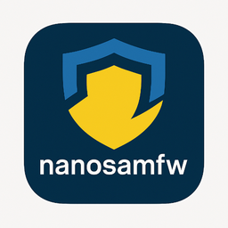

# nanosamfw Documentation

{ width="256" style="display:block; margin: 0 auto" }

**nanosamfw** (NotANOtherSamsungFirmware downloader) is a Python package providing programmatic access to Samsung firmware downloads through the Samsung Firmware Update Service (FUS).


> **Release {{ config.extra.release_tag }}** — {{ config.extra.release_title }}


## Overview

This package offers a clean, well-documented Python API for:

- **Firmware Discovery**: Query latest firmware versions from Samsung FOTA service
- **Secure Downloads**: Download firmware with resume capability via FUS protocol
- **Decryption**: Automatic decryption of ENC2/ENC4 encrypted firmware files
- **Device Integration**: Read device info via AT commands (normal/recovery mode) or Odin protocol (download mode)
- **Database Tracking**: Built-in SQLite tracking for firmware repository and IMEI operations
- **Integration Ready**: Designed for easy integration into tools and workflows

## Key Features

### 🔐 Full FUS Protocol Support
- BinaryInform, BinaryInit, and BinaryDownload operations
- Server nonce handling and cryptographic signature generation
- Device ID (IMEI/Serial) validation and auto-detection

### 📱 Device Detection (Two Modes)
- **AT Commands** (Normal/Recovery Mode): `read_device_info_at()` — reads model, IMEI, firmware, region via AT+DEVCONINFO
- **Odin Protocol** (Download Mode): `read_device_info()` — sends DVIF command for detailed device info
- Auto-detect via `detect_download_mode_devices()` (cross-platform, requires pyserial and Samsung USB drivers on Windows)
- Seamless integration with firmware download workflow

### 📦 High-Level Download API
- One-line firmware downloads with automatic version resolution
- HTTP Range support for resuming interrupted downloads
- Progress callback support for custom UI integration

### 🔓 Firmware Decryption
- ENC2 (MD5-based) and ENC4 (logic-value-based) decryption
- Automatic key derivation from FUS responses
- Streaming decryption with progress tracking

### 💾 Firmware Repository
- Centralized firmware storage (one record per version, no model/CSC duplication)
- Cached InformInfo metadata including logic values for efficient operations
- IMEI event logging with FUS status tracking (ok/error/denied/unauthorized/throttled/unknown)
- Repository pattern with clean data access layers

## Architecture

nanosamfw uses a three-layer architecture for clean separation of concerns:

```
┌──────────────────────────────────────────────────────┐
│                   Service Layer                      │
├──────────────────────────────────────────────────────┤
│ check_and_prepare_firmware() │ FOTA check + cache   │
│ get_or_download_firmware()   │ FUS download + resume│
│ decrypt_firmware()           │ Repository → decrypt │
│ download_and_decrypt()       │ Full workflow end-end│
└──────────────────────────────────────────────────────┘
                           │
                           ▼
┌──────────────────────────────────────────────────────┐
│                Repository Layer                      │
├──────────────────────────────────────────────────────┤
│ firmware_repository.py   │ FirmwareRecord CRUD      │
│ imei_repository.py       │ IMEIEvent logging        │
└──────────────────────────────────────────────────────┘
                           │
                           ▼
┌──────────────────────────────────────────────────────┐
│                  Database Layer                      │
├──────────────────────────────────────────────────────┤
│ firmware.db (SQLite, WAL mode)                       │
│  ├─ firmware  │ one per version, logic_value cached │
│  └─ imei_log  │ FOTA queries + FUS status tracking  │
└──────────────────────────────────────────────────────┘
```

**Key Design Principles:**

- **Firmware Repository**: Centralized storage — one record per firmware version (no model/CSC duplication)
- **Smart Downloads**: Checks repository before downloading from FUS servers
- **Cached Metadata**: Stores InformInfo data including logic values for efficient ENC4 decryption without extra FUS calls
- **Separation of Concerns**: FOTA check, download, and decrypt are independent operations
- **Status Tracking**: IMEI log captures all FOTA queries with FUS operation status (ok/error/denied/unauthorized/throttled/unknown)
- **Error Handling**: FUSError subclasses with built-in messages (InformError.BadStatus, FOTAError, etc.)

## Quick Start

### Complete Workflow

```python
from download import download_and_decrypt

# Download and decrypt in one call
firmware, decrypted = download_and_decrypt(
    model="SM-G998B",
    csc="EUX",
    device_id="352976245060954",
    resume=True,
)

print(f"Version: {firmware.version_code}")
print(f"Decrypted file: {decrypted}")
```

### Separate Operations

```python
from download import check_and_prepare_firmware, get_or_download_firmware, decrypt_firmware

# 1. Check FOTA for latest version and repository cache
version, is_cached = check_and_prepare_firmware(
    "SM-G998B", "EUX", "352976245060954", "current_firmware_version"
)
print(f"Latest: {version}, Cached: {is_cached}")

# 2. Download to repository (if not already present)
firmware = get_or_download_firmware(version, "SM-G998B", "EUX", "352976245060954")
print(f"Encrypted file: {firmware.encrypted_file_path}")

# 3. Decrypt from repository (can be deferred!)
decrypted = decrypt_firmware(version)
print(f"Decrypted file: {decrypted}")
```

### Repository Queries

```python
from download import find_firmware, list_firmware

# Find specific version
fw = find_firmware("G998BXXU1ATCT/...")
if fw:
    print(f"Logic value: {fw.logic_value_factory}")
    print(f"Size: {fw.size_bytes} bytes")

# List all firmware in repository
for fw in list_firmware(limit=10):
    print(f"{fw.version_code}: {fw.filename}")
```

### Device Integration — AT Commands (Normal/Recovery Mode)

```python
from device import read_device_info_at
from download import check_and_prepare_firmware, download_and_decrypt

# Auto-detect connected device (requires pyserial)
device = read_device_info_at()
print(f"Connected: {device.model} — IMEI: {device.imei}")
print(f"Current firmware: {device.firmware_version}")
print(f"Region: {device.sales_code}")

# Check for updates and download if available
latest, is_cached = check_and_prepare_firmware(
    device.model, device.sales_code, device.imei, device.firmware_version
)

if latest != device.firmware_version:
    firmware, decrypted = download_and_decrypt(
        device.model, device.sales_code, device.imei, device.firmware_version
    )
    print(f"Decrypted: {decrypted}")
```

### Device Integration — Odin Protocol (Download Mode)

```python
from device import read_device_info, detect_download_mode_devices, is_odin_mode
from download import check_and_prepare_firmware, download_and_decrypt

# 1. Detect device in download mode
devices = detect_download_mode_devices()
if devices:
    # 2. Verify it's in Odin mode
    if is_odin_mode(devices[0].port_name):
        # 3. Read device info via DVIF protocol
        device = read_device_info(devices[0].port_name)
        print(f"Connected: {device.model} — Firmware: {device.fwver}")
        print(f"Region: {device.sales}")
        
        # 4. Check for updates (no IMEI available in download mode)
        latest, is_cached = check_and_prepare_firmware(
            device.model, device.sales, "", device.fwver
        )
        
        if latest != device.fwver:
            firmware, decrypted = download_and_decrypt(
                device.model, device.sales, "", device.fwver
            )
            print(f"Decrypted: {decrypted}")
```

## Requirements

- **Python 3.14 or higher**
- **Core Dependencies**:
  - `pycryptodome` — Cryptographic operations (AES, PKCS7)
  - `requests` — HTTP client for FUS/FOTA communication
  - `tqdm` — Progress bars for download/decrypt
- **Device Detection** (optional):
  - `pyserial ≥ 3.5` — Serial port communication (cross-platform)
  - Samsung USB drivers (Windows only, for download mode)

## Installation

```bash
pip install -r requirements.txt
```

For development/docs building:

```bash
pip install -r dev-requirements.txt
```

## Project Structure

### Core Modules

- **[fus](api/fus.client.md)** — FUS protocol client and utilities
  - Client implementation with session management and NONCE rotation
  - Cryptographic operations and key derivation (AES-128, MD5)
  - Firmware version parsing and normalization
  - Device ID validation (IMEI/Serial TAC)
  - Error handling with FUSError subclasses

- **[download](api/download.service.md)** — High-level download service
  - Firmware repository management (one record per version)
  - FOTA version checking with IMEI logging
  - Smart download (skips if already cached)
  - On-demand decryption with cached logic values
  - Configuration and path management
  - Status tracking (ok/error/denied/unauthorized/throttled/unknown)

- **[device](api/device.md)** — Device detection and information reading
  - **AT Commands** (normal/recovery mode): `read_device_info_at()`
  - **Odin Protocol** (download mode): `read_device_info()`, `is_odin_mode()`
  - Auto-detect via `detect_download_mode_devices()`
  - Cross-platform support (Windows/Linux/macOS)

## Documentation Sections

- **[Core API](api/fus.client.md)** — FUS client, cryptography, device validation, errors
- **[Download API](api/download.service.md)** — Service layer, repositories, configuration
- **[Device API](api/device.md)** — Device detection (AT/Odin protocols), models, errors
- **[Database](database/schema.md)** — Schema documentation and repository patterns

## License

This project is MIT licensed. See the [LICENSE](https://github.com/yanuino/nanosamfw/blob/main/LICENSE) file for details.

Built upon [GNSF](https://github.com/keklick1337/gnsf) by [keklick1337](https://github.com/keklick1337) — thanks for the excellent foundation!

## Contributing

Contributions are welcome! Please ensure:

- **Code Style**: PEP 8, 100-char line length (Black + Pylint enforced)
- **Type Hints**: Required for all function parameters and return values
- **Docstrings**: Google-style with proper `Args:`, `Returns:`, `Raises:` sections
- **Testing**: Manual validation scripts included; test against real Samsung servers

## Links

- [GitHub Repository](https://github.com/yanuino/nanosamfw)
- [Issue Tracker](https://github.com/yanuino/nanosamfw/issues)
- [Releases](https://github.com/yanuino/nanosamfw/releases)
- [Documentation](https://yanuino.github.io/nanosamfw/)
